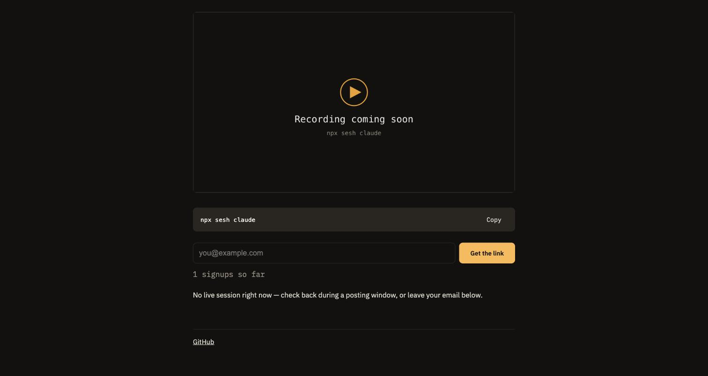

# sesh

A live share link for your local Claude Code or Codex session. `npx sesh-live claude` wraps
the command in a PTY, streams the terminal to a relay, and prints a link. A friend opens the
link and watches the session update in a browser, read-only. The agent process itself never
leaves your laptop; only terminal bytes cross the wire.

This is milestone 0: a demand probe. No encryption, no wheel (typing on someone else's
session), no packaging beyond the raw npm script below.



## Live

- Landing: https://sesh-live.pages.dev
- Viewer: https://sesh-live-viewer.pages.dev
- Relay: https://sesh-relay.sesh-relay.workers.dev

## Layout

- `apps/landing` — the one-screen pitch, signup form, and demo link. Vite + React, static, on Cloudflare Pages.
- `apps/viewer` — the read-only terminal, xterm.js. Vite + React, static, on Cloudflare Pages.
- `apps/relay` — one Cloudflare Worker, one Durable Object per room, D1 for signups and join counts.
- `packages/host` — `sesh-live`, the npm package that wraps the agent CLI in a PTY and streams it to the relay.

## Run it

Host a session (from `packages/host`):

```
node index.js claude --room my-room-id --name "my session"
```

Or once published:

```
npx sesh-live claude
```

Watch it at `https://sesh-live-viewer.pages.dev/#my-room-id`.

Run the web apps locally:

```
cd apps/landing && npm run dev   # http://localhost:5173
cd apps/viewer && npm run dev    # http://localhost:5174
cd apps/relay && npm run dev     # http://localhost:8787
```

## Deploy

Relay (Cloudflare Worker + D1):

```
cd apps/relay
wrangler d1 create sesh-signups   # once; paste the id into wrangler.toml
wrangler d1 execute sesh-signups --remote --file=schema.sql
wrangler deploy
```

Viewer and landing (Cloudflare Pages):

```
cd apps/viewer && VITE_RELAY_ORIGIN=<relay url> npm run build
wrangler pages deploy dist --project-name sesh-live-viewer --branch master

cd apps/landing && VITE_RELAY_ORIGIN=<relay url> VITE_DEMO_SESSION_URL=<viewer url>/#demo-room-0001 npm run build
wrangler pages deploy dist --project-name sesh-live --branch master
```

Set `ALLOWED_ORIGINS` in `apps/relay/wrangler.toml` to the two deployed Pages origins
(comma-separated) and redeploy the relay so CORS allows them.

Host package (`packages/host`): publish as `sesh-live` on npm after setting `RELAY_ORIGIN`
(`wss://` scheme) and `VIEWER_ORIGIN` in `config.js` to the deployed relay and viewer.
